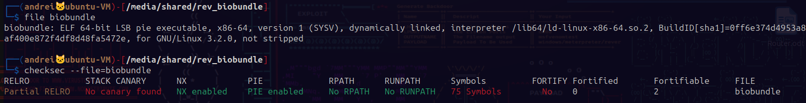

# Biobundle Rev Medium

Challange was done during HTB University 2023.

## First part
Reverse engineering the first binary `biobundle`.
 

### Disassembly of main

 
We see that the function get_handle returns a handle to an open shared object or executable, because `local_10` is used as an argument in `dlsym`.
 
The function `dlsym` is not user-defined and according to the `Linux manual page` it returs the address of a symbol in a shared object or executable, in this case, the symbol `_`. On failure it returns `NULL`.
 
After that not much happens, we are prompted to enter a string of at most 127 characters which will be used as a parameter in the function `_` in the shared object. If the output is different than 0 we have untangled the bundle.

### Disassembly of get_handle

 
Using `memfd_create` an anonymous file is created with the name `:^)`.
 
After that a buffer of length `15880` bytes is written into that file. That must be our shared object. The data written into the file object is hardcoded into the main program's memory at symbol `__` but it is xored with `0x37`.
 
I have not found a use for the second for loop but after that using `dlopen` the shared memory object is open using the file descriptor returned by `memfd_create`.
 
To get the shared memory object we could either take that hardcoded values and xor them by `0x37`, or just run the program and take the file directly from `/proc` because the file is created before we are asked for input.
 

### Disassembly of the shared object

 
There is a string kept in a contiguous memory of 28 bytes but it is assembled back using 8 bytes at a time. The input is compared to this string, which is the flag (see on the left, change endianness) and 1 is returned if they are equal and 0 otherwise. This backs up the final printing logic in main.
 
 
To check:
 
