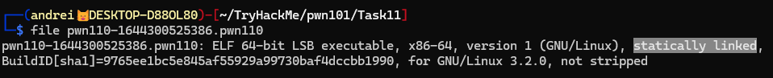
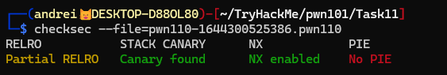
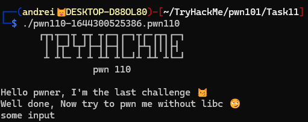
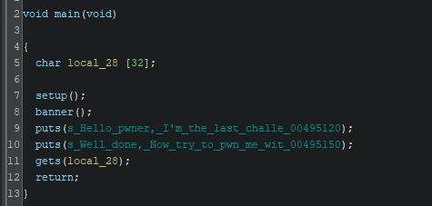

# MPROTECT

## Binary information

Running file on the binary we see that it is statically linked. So compared to the previous task, now we cannot overwrite contents of the GOT table and perform a `ret2libc` attack.

Running checksec on the file reveals that the binary has **NX** enabled, which means we cannot execute shellcode. (yet)

Executing the binary we can see that it asks for input and after that it just exits.

## Reversing

Decompiling the binary using Ghidra we see that the vulnerability is obvious. The binary reads input in a buffer of size `32` using `gets` function.

Since the binary is `statically linked` we know that there is something to do with it. After looking at the symbols we see that we have the function `mprotect` available.

Mprotect is a system call in Linux that changes the permission of a memory region. We can use this to change the permission of the stack to `executable` and then execute our.

Mprotect takes 3 arguments:

- `addr`: The start address of the memory region whose permissions are to be changed.
- `len`: The length of the memory region whose permissions are to be changed.
- `prot`: The new permissions for the memory region.

One thing to note is that addr must be page aligned. In this case we assume that the page size is 4096 bytes so at least the last 12 bits of the address must be zero.
