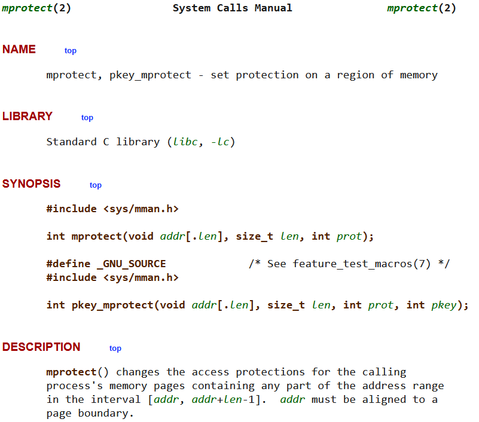
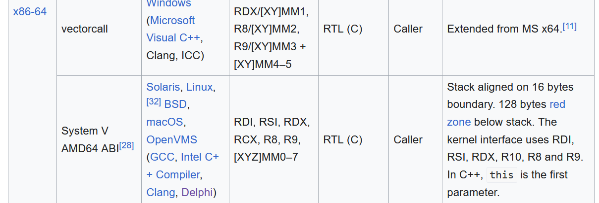

# MPROTECT

## Binary information

Running file on the binary we see that it is statically linked. So compared to the previous task, now we cannot overwrite contents of the GOT table and perform a `ret2libc` attack.


Running checksec on the file reveals that the binary has **NX** enabled, which means we cannot execute shellcode. (yet)


Executing the binary we can see that it asks for input and after that it just exits.


## Reversing

Decompiling the binary using Ghidra we see that the vulnerability is obvious. The binary reads input in a buffer of size `32` using `gets` function.


Since the binary is `statically linked` we know that there is something to do with it. After looking at the symbols we see that we have the function `mprotect` available.

Mprotect is a system call in Linux that changes the permission of a memory region. We can use this to change the permission of the stack to `executable` and then execute our.

Mprotect takes 3 arguments:

- `addr`: The start address of the memory region whose permissions are to be changed.
- `len`: The length of the memory region whose permissions are to be changed.
- `prot`: The new permissions for the memory region.

One thing to note is that addr must be page aligned. In this case we assume that the page size is 4096 bytes so at least the last 12 bits of the address must be zero.



## Exploitation

But where is the start address of the page? We do not know where the stack is in memory at runtime. Luckily, the `__libc_stack_end` symbol is included in the binary. This symbol points to the end of the stack. We can use puts to leak this address

By following `x86_64` calling convention, the first argument is passed in `rdi`, the second in `rsi` and the third in `rdx`.



So we need to see if we can find the `ROP gadgets` that would help us set these three arguments. Using `ROPgadget` we see that we have the following gadgets:


Let's see what we have so far:

1. We have a buffer overflow vulnerability.
2. We have the `mprotect` function available.
3. We can leak the address of the end of the stack.
4. We can make the stack executable.

Let's see how the exploit looks until here

```python
from pwn import *

stack_end_sym_addr = p64(0x004bfa70)

io.recvuntil(" libc 😏")
io.clean()

payload = b'A' * 40
popRDIAddr = p64(0x40191a) #pop rdi; ret
popRSIAddr = p64(0x40f4de) # pop rsi ; ret
popRDXAddr = p64(0x40181f) # pop rdx ; ret
jmpRSPAddr = p64(0x463c43) # jmp rsp

payload += popRDIAddr
payload += stack_end_sym_addr
payload += p64(0x00411bd0) #puts addr
payload += p64(0x00401e61) #main addr

io.sendline(payload)
endAddrOfStack = u64(io.recvline().strip().ljust(8, b'\x00'))
```
